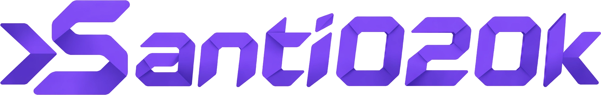

# [Santiago Molina](https://santi020k.com/)



## I build fast, accessible products and stronger frontend systems.

Santiago is a seasoned **Full Stack Developer** and **Tech Lead** with over a decade of experience. He specializes in frontend architecture, product systems, and leading high-performance teams to deliver scalable solutions.

---

### 🚀 Key Features

- **Astro 6 Power**: Built with the latest Astro framework for optimized performance.
- **Tailwind CSS v4**: Modern, future-proof styling with zero-runtime CSS.
- **Alpine.js Interactivity**: Lightweight, reactive features without the overhead.
- **Content Collections**: Type-safe Markdown and MDX for blog posts and projects.
- **Accessibility First**: WCAG 2.2 AA compliant, ensuring an inclusive experience for all.
- **View Transitions**: Seamless, app-like navigation between pages.

---

### ⚡ Tech Stack

[](https://astro.build/)
[](https://tailwindcss.com/)
[](https://alpinejs.dev/)
[](https://www.typescriptlang.org/)
[](https://vitest.dev/)
[](https://playwright.dev/)
[](https://vercel.com/)

---

### 📂 Project Structure

| Path | Purpose |
| --- | --- |
| `src/site.config.ts` | Site-wide metadata, navigation, and social links. |
| `src/content.config.ts` | Content collection schemas (Zod). |
| `src/content/` | Content collections (blog posts, portfolio projects). |
| `src/layouts/` | Core page layouts using Astro. |
| `src/components/` | Reusable UI components (Atoms, Molecules, Organisms). |
| `src/styles/global.css` | Tailwind v4 theme tokens and global styles. |
| `tests/` | Unit (Vitest) and E2E (Playwright) test suites. |

---

### 🛠️ Getting Started

#### 1. Install Dependencies
```bash
pnpm install
```

### 2. Start the Development Server

```bash
pnpm run dev
```
Accessible at `http://localhost:4321`.

#### 3. Build for Production
```bash
pnpm run build
```

### 4. Other Commands

```bash
pnpm run lint      # Linting with ESLint
pnpm run check     # Astro type-checking
pnpm run test      # Unit testing
pnpm run test:e2e  # E2E testing
```

---

### 📫 Connect with Santiago

[](https://linkedin.com/in/santi020k)
[](https://github.com/santi020k)
[](https://medium.com/@santi020k)
[](https://api.whatsapp.com/send?phone=573507990136)

---

&copy; 2026 Santiago Molina. All rights reserved.
