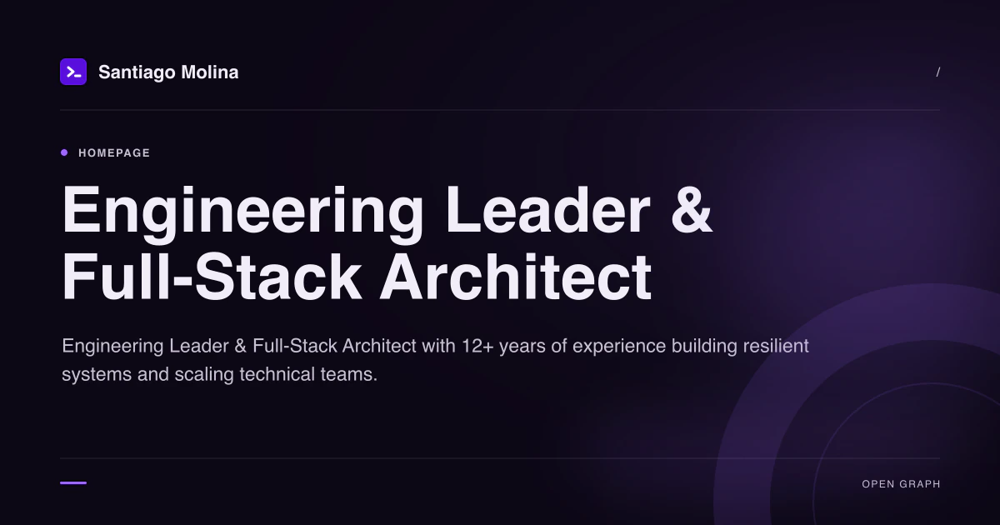
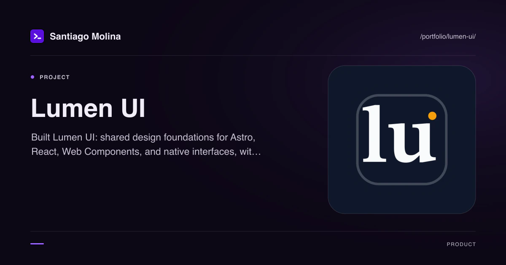
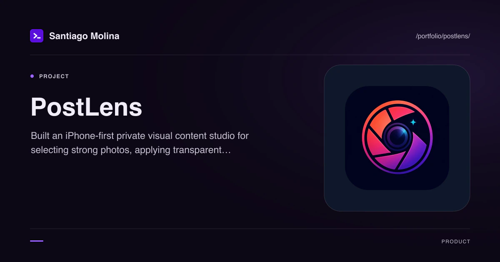
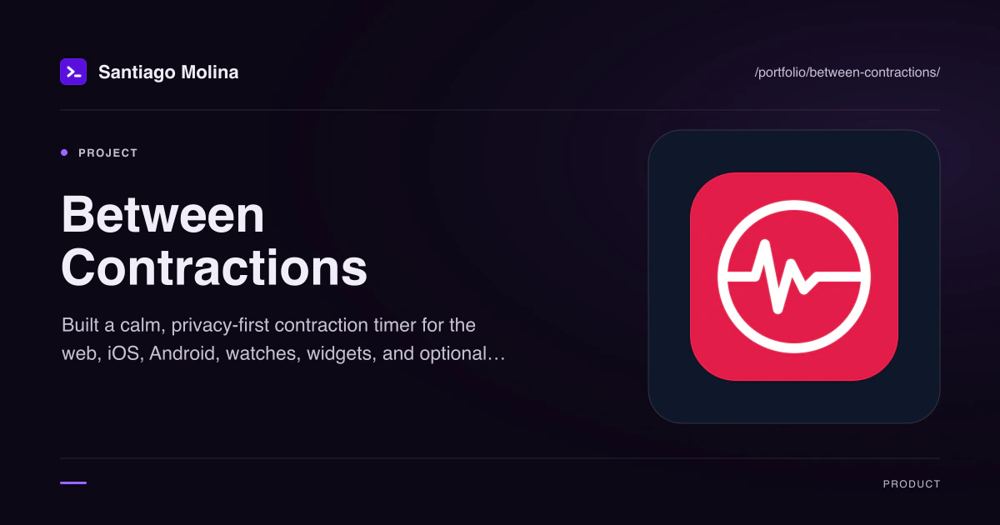
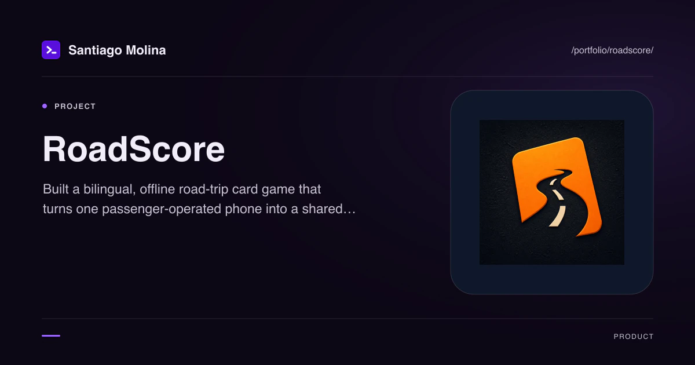

# santi020k.com

<p align="center">
  <a href="https://santi020k.com/">
    
  </a>
</p>

<p align="center">
  <strong>Thoughtful products. Clear systems. Useful writing.</strong><br>
  Santiago Molina’s portfolio, writing, and life outside code.
</p>

<p align="center">
  <a href="https://santi020k.com/">Website</a> ·
  <a href="https://santi020k.com/work/">Experience</a> ·
  <a href="https://santi020k.com/portfolio/">Case studies</a> ·
  <a href="https://santi020k.com/blog/">Blog</a> ·
  <a href="https://santi020k.com/travel/">Travel</a> ·
  <a href="https://santi020k.com/resume/">Résumé</a>
</p>

<p align="center">
  <a href="https://github.com/santi020k/website/actions/workflows/build.yml"></a>
  <a href="https://github.com/santi020k/website/actions/workflows/codeql.yml"></a>
  <a href="./docs/lumen-integration.md"></a>
  <a href="./LICENSE"></a>
</p>

I’m [Santiago Molina](https://github.com/santi020k), an engineering leader, full-stack architect,
and product builder. Since 2014, I’ve worked across commerce, sports media, esports, developer
tools, and native apps. This site connects that work with the decisions, experiments, and
experiences behind it.

This repository is also a working consumer of my developer tools: Lumen provides the interface
contracts, Theme supplies shared foundations, and OG generates social cards. The website keeps
its own content, editorial layouts, and application behavior. Follow the source and verification
commands below to see how those boundaries work together.

**Explore:** [The site](#explore-the-site) · [Products](#products-and-the-systems-behind-them) · [Architecture](#how-the-site-works) · [Local setup](#run-it-locally) · [Quality](#verify-a-change) · [Documentation](#find-your-next-step) · [Feedback](#feedback-and-contributions)

## Explore the site

| Start here | What you’ll find |
| --- | --- |
| [Experience](https://santi020k.com/work/) / [Case studies](https://santi020k.com/portfolio/) | Engineering roles and the systems behind the work. |
| [Projects](https://santi020k.com/projects/) | Developer tools and personal products, with their technology stacks. |
| [Writing](https://santi020k.com/blog/) | Software decisions, books, games, and everyday experiences. |
| [Speaking](https://santi020k.com/speaking/) | Talks, workshops, and community work. |
| [Travel](https://santi020k.com/travel/) | An interactive country map and personal travel notebook. |
| [Résumé](https://santi020k.com/resume/) | A readable web résumé and concise or full PDF downloads. |

Light and dark themes, keyboard search, responsive layouts, and reduced-motion support run
through the site. Browser tests cover the interactions; the accessibility statement records the
[accessibility scope and feedback path](https://santi020k.com/accessibility/).

## Products and the systems behind them

<table>
  <tr>
    <td><a href="https://santi020k.com/portfolio/lumen-ui/"></a></td>
    <td><a href="https://santi020k.com/portfolio/postlens/"></a></td>
  </tr>
  <tr>
    <td><strong><a href="https://lumen.santi020k.com/">Lumen UI</a></strong><br>Shared interface foundations across web and native platforms.</td>
    <td><strong><a href="https://postlens.santi020k.com/">PostLens</a></strong><br>A visual content studio for iPhone and iPad.</td>
  </tr>
  <tr>
    <td><a href="https://santi020k.com/portfolio/between-contractions/"></a></td>
    <td><a href="https://santi020k.com/portfolio/roadscore/"></a></td>
  </tr>
  <tr>
    <td><strong><a href="https://between.santi020k.com/">Between Contractions</a></strong><br>A calm contraction timer with native apps, watches, and widgets.</td>
    <td><strong><a href="https://roadscore.santi020k.com/">RoadScore</a></strong><br>An offline road-trip game with a shared scoreboard and trip journal.</td>
  </tr>
</table>

*Generated project artwork from this repository, rather than application screenshots.*
[Browse projects](https://santi020k.com/projects/) or [read professional case studies](https://santi020k.com/portfolio/).

## How the site works

| Foundation | What it does here |
| --- | --- |
| **Astro 7 + TypeScript** | Static pages, typed content collections, Markdown/MDX, and View Transitions. |
| **Lumen 4 + Tailwind CSS v4** | Accessible Astro primitives, shared semantic tokens, and site-owned editorial composition. |
| **Native JavaScript** | Search, filtering, sharing, and progressive enhancement without a frontend framework runtime. |
| **Owned tooling** | Theme tokens, OG generation, ESLint configs, Commitprompt, Quality hooks, and Astro Doctor diagnostics. |
| **Cloudflare Pages** | Production deployment from reviewed `main`, with versioned redirects, caching, and security headers. |

The [Lumen integration guide](docs/lumen-integration.md) maps the components in use, application-owned
controllers, v4 styling contracts, and upgrade checks. The catalog and lockfile use coordinated
`@santi020k/lumen`, `lumen-astro`, and `lumen-core` 4.0.0 packages from the npm registry.

### Content with room for a life outside code

- **Blog:** one chronological feed for software, reading, gaming, hobbies, and everyday experiences.
  Published tags generate topic archives; reading and gaming remain discoverable in the filters.
- **Travel:** Lumen `WorldMap` connects country visit counts with personal notes. Follow the
  [travel editing guide](docs/editorial/travel.md) for data and title-only drafts.
- **Projects:** `relevanceWeight` ranks personal projects consistently across the homepage,
  portfolio, projects gallery, and structured data. Lumen, PostLens, Between Contractions,
  and RoadScore lead the selection.
- **Search:** the header searches posts and projects; open it with `/`, ⌘K, or Ctrl+K.

### The developer tools behind this repository

| Project | Its boundary here |
| --- | --- |
| [Lumen UI](https://github.com/santi020k/lumen) | Astro components, semantic tokens, motion, and public styling hooks. |
| [Santi020k Theme](https://github.com/santi020k/santi020k-theme) | Shared brand tokens and canonical product URLs. |
| [OG](https://github.com/santi020k/og) | Generated social artwork, versioned manifests, and metadata audits. |
| [ESLint Config Basic](https://github.com/santi020k/eslint-config-basic) | Coordinated Astro, TypeScript, browser-test, and tooling rules. |
| [Quality](https://github.com/santi020k/quality) / [Commitprompt](https://github.com/santi020k/commitprompt) | Repository hooks and validated Conventional Commits. |
| [Astro Doctor](https://github.com/santi020k/astro-doctor) | Changed-code diagnostics in pull requests. |

### Source map

| Path | Responsibility |
| --- | --- |
| `src/site.config.ts` | Metadata, navigation, and social links. |
| `src/content.config.ts` / `src/content/` | Schemas, posts, projects, and editorial data. |
| `src/layouts/` / `src/components/` | Page composition and reusable Astro UI. |
| `src/styles/global.css` / `src/styles/partials/` | Shared style boundary, tokens, and page styles. |
| `scripts/` | Assets, content checks, CV generation, sitemap, and deployment helpers. |
| `markdownlint.config.json` | Markdown rules and file scope, checked through the engine and native file discovery. |
| `src/**/__tests__/` / `tests/` | Unit and rendered browser regression coverage. |
| `docs/` | Editorial, UI, security, SEO, and deployment guidance. |

## Run it locally

Use **Node.js 24+** and **pnpm 11.25.0**, as declared in `package.json`.

```bash
git clone https://github.com/santi020k/website.git
cd website
pnpm install --frozen-lockfile
pnpm run dev
```

Open `http://localhost:4321`. Basic local development does not require service credentials.
Optional build integrations and production configuration are documented in the
[deployment runbook](docs/deployment.md).

To build and serve the static output:

```bash
pnpm run build
pnpm run preview
```

[Quality CLI](https://github.com/santi020k/quality) v1.3.0 powers repository Git hooks. Install it
with the checksum-verifying installer, then mount the hooks:

```bash
curl --proto '=https' --tlsv1.2 -fsSL \
  https://raw.githubusercontent.com/santi020k/quality/main/install.sh \
  | sh -s -- santi020k/quality v1.3.0
pnpm run hooks:install
```

Dependency installation remains non-blocking when Quality is absent and prints recovery instructions.
Normal commands use published Lumen packages. The isolated
[candidate preview](docs/lumen-integration.md#lumen-4-candidate-preview) is available for evaluating
future library changes without committing tarballs.

## Verify a change

| Command | Evidence |
| --- | --- |
| `pnpm run verify:fast` | Spellcheck, zero-warning lint, strict Astro checks, Markdown/content checks, CV consistency, unit tests, and build. |
| `pnpm run audit` | Moderate-and-higher dependency vulnerability audit, including development dependencies. |
| `pnpm run ci:verify` | Coverage, production build, Lighthouse assertions, and stable Chromium E2E alongside quality checks. |
| `pnpm run audit:seo` | Built-page metadata, canonical, and social-image audit. |
| `pnpm run audit:pages` | Every built document: local links/assets (including responsive image candidates), fragments, duplicate IDs, and page landmarks. |
| `pnpm run lint:content` | Frontmatter and editorial quality checks. |

For a focused browser run against an existing build:

```bash
SKIP_BUILD=1 pnpm run test:e2e:ci:stable tests/lumen-interactions.spec.ts --retries=0
```

`pnpm run test:e2e:fast` reuses an existing build; browser-test scripts install Chromium when
needed. Run `pnpm run build` first when verifying changed routes. Use `pnpm run lighthouse`
for a local lab audit. Passing checks describe the revision tested; badges above describe their
workflow runs and do not certify an unpublished release candidate.

<details>
<summary>Generated assets and release boundaries</summary>

Builds regenerate favicons, fonts, and OG images before Astro renders pages.
OG 1.2.0 writes content-versioned image URLs to `public/og/manifest.json`; page
metadata uses those URLs so changed cards invalidate social preview caches.
Explicit custom artwork and unlisted utility-page fallbacks remain supported.
ESLint Basic 3.6.0 owns browser-test detection through `testingFiles.playwright`,
with `tests/**/*.spec.ts` declared in the site configuration. After-build scripts
assemble the cross-site sitemap, generate Cloudflare redirects, and audit SEO and local page integrity.

`pnpm run generate:project-images` discovers frontmatter and logos, producing thumbnail,
horizontal, and portrait covers. `src/utils/project-cover.ts` owns fallback selection. The
projects index uses an editorial gallery; technology archives retain the default gallery.

`pnpm run generate:cv` builds the site and regenerates résumé downloads after UI or dependency
changes. Do not edit generated files by hand.

The v4 redesign is consolidated on `release/v4.0.0`. Production publishing follows the reviewed
GitHub workflow from `main`; local validation and integration are separate from remote merge,
Cloudflare deployment, and production smoke checks. See the
[deployment runbook](docs/deployment.md) for Changesets, protected checks, and rollback.

</details>

## Find your next step

| Resource | Use it for |
| --- | --- |
| [Contributing](CONTRIBUTING.md) | Setup, validation, contribution scope, and review evidence. |
| [Lumen integration](docs/lumen-integration.md) | Components, stable styling hooks, and v4 upgrade checks. |
| [Theming](docs/theming.md) / [Brand](docs/brand-guidelines.md) | Theme behavior and visual standards. |
| [Sitemaps](docs/sitemaps.md) | Canonical routes and cross-site search discovery. |
| [Deployment](docs/deployment.md) | Release automation, environment setup, smoke checks, and rollback. |
| [v4 readiness](docs/v4-release-readiness.md) | Current integration, browser coverage, review findings, and release gates. |
| [Cache strategy](docs/cache-strategy.md) | Browser and edge cache behavior. |
| [Security](.github/SECURITY.md) / [Incident response](docs/incident-response.md) | Private vulnerability reports and recovery. |
| [Observability](docs/observability.md) | Existing diagnostic boundaries and operational evidence. |
| [Changelog](CHANGELOG.md) | Version history. |

## Feedback and contributions

[Report a bug or accessibility problem](https://github.com/santi020k/website/issues/new?template=bug_report.yml),
[correct content or a broken link](https://github.com/santi020k/website/issues/new?template=content_correction.yml),
or [suggest an improvement](https://github.com/santi020k/website/issues/new?template=feature_request.yml).
Reports are public: remove personal information, tokens, and private screenshots. Follow the
[security policy](.github/SECURITY.md) for suspected vulnerabilities.

This is a personal, **source-available** site. Issues, suggestions, and pull requests are welcome
under the contribution terms in [LICENSE](LICENSE); the code, content, images, and brand assets
are not licensed for reuse in other products.

## Connect with Santiago

[Website](https://santi020k.com/) · [GitHub](https://github.com/santi020k) ·
[LinkedIn](https://linkedin.com/in/santi020k) · [Medium](https://medium.com/@santi020k) ·
[Email](mailto:hi@santi020k.com)

© 2026 [Santiago Molina](https://santi020k.com/). All rights reserved.
