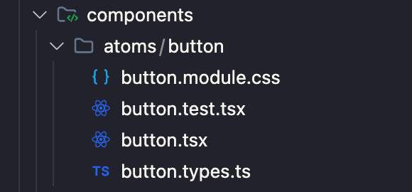

In this post, I share insights into establishing a robust structure for React projects using an Atomic Module Component approach. From initial scaffolding to naming conventions, discover best practices for maintaining scalability and organization in your codebase.

## Introduction

My goal is to write a post every week until I complete my personal blog and leave a compilation of best practices.

Having witnessed numerous incorrect approaches, I’d like to share with the community how I prefer to do things. React, being a library rather than a framework, offers a lot of freedom, but it can also become a dangerous tool over time, especially as projects grow. I want to show the community how to approach a project from the beginning to prevent growth from becoming a problem.

There are topics I’ll address that are largely a matter of personal opinion, and other developers may have different views. I’ll provide my opinion, and the community can consider it a suggestion, adopting what works best for them.

This first post is about a base project and how I handle the initial scaffold. The three most important links and things to know before approaching this post are:

[Atomic Design](https://bradfrost.com/blog/post/atomic-web-design/)

[GitHub Repository](https://github.com/santi020k/posts/tree/post-1)

## The initial stack includes

- Next.js
- React
- Vitest
- Tailwind
- TypeScript
- ESLint

It’s just a base project. We may add many more things in future posts, such as a pre-commit with Husky, Storybook, a better ESLint configuration, etc.

## Base Project Structure

```text
├── /config
| ├── /Tests
| | ├── /setup.ts

├── /public
| ├── /next.svg
| ├── /vercel.svg

├── /src
| ├── /app
| | ├── /favicon.ico
| | ├── /global.css
| | ├── /layout.tsx
| | ├── /page.tsx

| ├── /components
| | ├── /atoms
| | | ├── /button
| | | | ├── /button.module.css
| | | | ├── /button.test.tsx
| | | | ├── /button.tsx
| | | | ├── /button.type.ts

| | ├── /molecules
| | | ├── /button
| | | | ├── /group-buttons.test.tsx
| | | | ├── /group-buttons.tsx

| | ├── /organisms
| | | ├── /.keep
```

I find atomic design to be an ideal structure because it’s the same structure used in design. This greatly facilitates implementation. I’ve seen many projects where components are simply thrown into a components folder and have components within components. This makes navigation and finding things very difficult. It becomes chaotic as the application grows. I recommend avoiding such practices. It’s ideal to have components organized in a better way.

Here’s an example of a button component:



Another common mistake in frontend development is separating a component’s code into multiple folders: one for tests, one for interfaces/types, one for components, etc. This greatly complicates code navigation. Personally, I prefer to have everything related to a component in one place, like the previous example.

Now, a very controversial topic is how folders and files are named. In my experience, giving freedom or not having a clear pattern in this regard can lead to problems of mixed implementation, where one developer implements something one way and another developer implements it differently. This becomes a headache over time, as it becomes increasingly difficult to resolve as the project grows. My suggestion is to keep it simple and easy to understand.

For example bad practice, using `PascalCase` for component files. Here are some common mistakes:

- `GroupButtons/GroupButtons.tsx`
- `group-buttons/GroupButtons.tsx`
- `GroupButtons/group-buttons.tsx`

Note: I’ve seen all types of cases in a single folder, including `snake_case`.

Personally, I prefer to use `kebab-case` for everything related to files. This way, I avoid my team getting confused and using a capital letter where it shouldn’t be. The more standardized these kinds of things are, the better it is to work with large teams, who won’t need to think about how to write the name. They should only focus on thinking of a good name for the file.

I prefer to have these kinds of things standardized to prevent my team from getting a little too creative in scaffolding the project.

- `group-buttons/group-buttons.tsx`

As for whether to call the component `index.tsx` or `button.tsx`, it’s also a quite complex topic. I’ve used both ways. Personally, I prefer button.tsx because when browsing files with a finder like VS Code’s, it’s easier to understand what a file is without having to read the entire path to the file. Another thing I like to do is to always have a folder containing a component with the same name, even if it’s alone. This is a bit repetitive, but it avoids having loose files that may later grow in the wrong place.

A useful tip is to import and export everything from the main component, so you don’t have to make so many imports when you need something related to a project.

```javascript
import styles from './button.module.css';
import { type ButtonProps, types } from './button.types'

const Button: React.FC<ButtonProps> = ({ children, onClick, type }) => {
  const buttonClasses = `${styles.button} ${type === types.primary ? styles.primary : styles.secondary}`;

  return (
    <button className={buttonClasses} onClick={onClick}>
      {children}
    </button>
  );
};

export default Button;

export { ButtonProps, types }
```

There are many topics related to code quality, such as the use of magic strings, typing, testing, that I don’t have time to cover in this post. In the next post, we’ll cover other topics as we progress through this project week by week. I’ll leave the branches with the content of each post in case the main branch changes a lot over time and you need access to a specific state of the project.

I hope this is helpful. If you have any questions, feel free to contact me. I’ll be happy to answer, as long as it’s within my capabilities.

[Next Post: About ESlint config](https://medium.com/@santi020k/building-the-best-next-js-typescript-standard-vitest-eslint-configuration-f6d91d6346e7)
