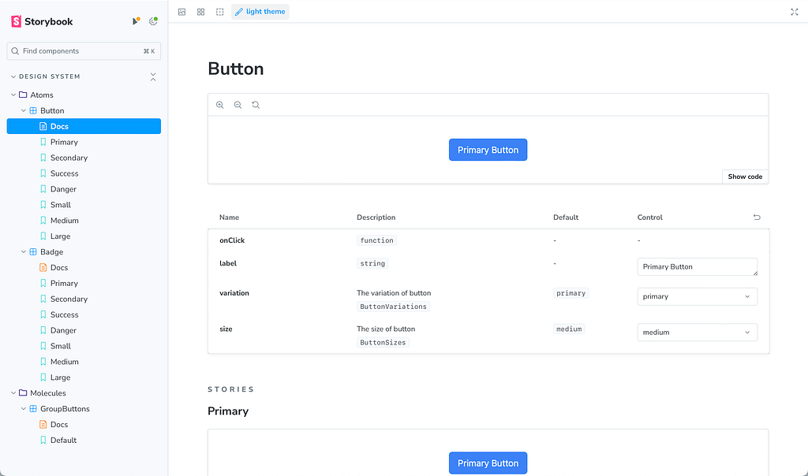

Continuing from our previous post on optimizing development workflows, today we’ll explore the power of Visual Development Experience (VDE) with Storybook in Action, alongside Next.js. While our last discussion emphasized the importance of pre-commit systems in ensuring code quality and stability, this post dives into enhancing UI development through Storybook’s isolated component environment. Let’s unlock the potential of these tools to streamline development, foster collaboration, and maintain UI consistency across projects.

[Read the Previous Post: Implementing Husky for Next.js](https://medium.com/@santi020k/development-workflow-with-husky-for-next-js-eslint-and-vitest-integration-d75548e48092)

[GitHub Repository](https://github.com/santi020k/posts/pull/5)

## Getting Started with Storybook

To integrate Storybook into your Next.js project, simply execute the following command:

```bash title="terminal"
npx sb init
```

This command initiates the installation of necessary dependencies, configuration setups, and file creations.

Once installed, start Storybook to visualize and interact with your components in an isolated environment:

```bash title="terminal"
npm run storybook
# or
yarn storybook
```

I recommend removing demo components and configuring your existing components with Storybook. In our case, as we are utilizing aliases for imports, they might pose compatibility issues. To address this, add the following configuration to Storybook:

`.storybook/main.ts`

```typescript title=".storybook/main.ts"
import type { StorybookConfig } from "@storybook/nextjs";
import path from 'path'

const config: StorybookConfig = {
  stories: ["../src/**/*.mdx", "../src/**/*.stories.@(js|jsx|mjs|ts|tsx)"],
  addons: [
    "@storybook/addon-onboarding",
    "@storybook/addon-links",
    "@storybook/addon-essentials",
    "@chromatic-com/storybook",
    "@storybook/addon-interactions",
  ],
  framework: {
    name: "@storybook/nextjs",
    options: {},
  },
  docs: {
    autodocs: "tag",
  },
  staticDirs: ["../public"],
  webpackFinal: async (config) => {
    if (!config.resolve) return config;

    config.resolve.alias = {
      ...config.resolve.alias,
      '@/': path.resolve(__dirname, '../src/'),
      '@/atoms': path.resolve(__dirname, '../src/components/atoms'),
      '@/molecules': path.resolve(__dirname, '../src/components/molecules'),
      '@/organisms': path.resolve(__dirname, '../src/components/organisms')
    };

    return config;
  }
};

export default config;
```

Note: New typescript way to implement aliases is better, in future post we can move our alias config to that

With this configuration, we resolve the issue seamlessly.

## Tailwind Integration

Enabling Tailwind support is straightforward. Simply include the following line in the Storybook preview:

`.storybook/preview.ts`

```typescript title=".storybook/preview.ts"
import "../src/app/globals.css";
```

Here’s an example:

`.storybook/preview.ts`

```typescript title=".storybook/preview.ts"
import type { Preview } from "@storybook/react";

import "../src/app/globals.css";

const preview: Preview = {
  parameters: {
    controls: {
      matchers: {
        color: /(background|color)$/i,
        date: /Date$/i,
      },
    },
  },
};
export default preview;
```

Now, with Storybook installed in our project, let’s proceed with some adjustments.

## Optional, but recommended

In many projects, root configurations can become overwhelming. Thus, I advocate for managing configurations within a dedicated folder. Although optional, I highly recommend moving the **.storybook** folder into **config/.storybook**.

To achieve this, make the following modifications:

Move **main** and **preview** from the root project to:

```text title="Project Structure"
├── /config
| ├── /.storybook
| | ├── /main.ts
| | ├── /preview.ts
```

Adjust the Storybook scripts in package.json:

`package.json`

```json title="package.json"
{
  "scripts": {
    "storybook": "storybook dev -p 6006 -c config/.storybook",
    "build-storybook": "storybook build -c config/.storybook"
  }
}
```

And update the Storybook main config:

`config/.storybook/main.ts`

```typescript title="config/.storybook/main.ts"
import type { StorybookConfig } from "@storybook/nextjs";
import path from 'path'

const rootDir = path.resolve(__dirname, '../..');

const config: StorybookConfig = {
  stories: [`${rootDir}/**/*.mdx`, `${rootDir}/**/*.stories.@(js|jsx|mjs|ts|tsx)`],
  addons: [
    "@storybook/addon-onboarding",
    "@storybook/addon-links",
    "@storybook/addon-essentials",
    "@chromatic-com/storybook",
    "@storybook/addon-interactions",
  ],
  framework: {
    name: "@storybook/nextjs",
    options: {},
  },
  docs: {
    autodocs: "tag",
  },
  staticDirs: [`${rootDir}/public`],
  webpackFinal: async (config) => {
    if (!config.resolve) return config;

    config.resolve.alias = {
      ...config.resolve.alias,
      '@/': `${rootDir}/src/`,
      '@/atoms': `${rootDir}/src/components/atoms`,
      '@/molecules': `${rootDir}/src/components/molecules`,
      '@/organisms': `${rootDir}/src/components/organisms`
    };

    return config;
  }
};

export default config;
```

`config/.storybook/preview.ts`

```typescript title="config/.storybook/preview.ts"
import type { Preview, ReactRenderer } from "@storybook/react";
import { withThemeByClassName } from '@storybook/addon-themes';
import '@storybook/addon-console';

import "../../src/app/globals.css";

// Preview configurations...

export default preview;
```

Now, creating component stories is straightforward. Let’s use our button component as an example:

`src/components/atoms/button/button.stories.ts`

```typescript title="src/components/atoms/button/button.stories.ts"
import Button, { type ButtonProps, ButtonSizes, ButtonVariations } from './button'

import type { Meta, StoryObj } from '@storybook/react'
import { fn } from '@storybook/test'

const meta = {
  title: 'Design System/Atoms/Button',
  component: Button,
  parameters: {
    layout: 'centered'
  },
  tags: ['autodocs'],
  args: { onClick: fn() },
  argTypes: {
    variation: {
      control: { type: 'select' },
      description: 'The variation of button',
      options: Object.values(ButtonVariations),
      table: {
        defaultValue: { summary: ButtonVariations.Primary },
        type: { summary: 'ButtonVariations' }
      }
    },    size: {
      control: { type: 'select' },
      description: 'The size of button',
      options: Object.values(ButtonSizes),
      table: {
        defaultValue: { summary: ButtonSizes.Medium },
        type: { summary: 'ButtonSizes' }
      }
    }
  }
} satisfies Meta<typeof Button>

export default meta

type Story = StoryObj<ButtonProps>

export const Primary: Story = {
  args: {
    label: 'Primary Button',
    variation: ButtonVariations.Primary,
    size: ButtonSizes.Medium
  }
}

export const Secondary: Story = {
  args: {
    label: 'Secondary Button',
    variation: ButtonVariations.Secondary
  }
}

export const Success: Story = {
  args: {
    label: 'Success Button',
    variation: ButtonVariations.Success
  }
}

export const Danger: Story = {
  args: {
    label: 'Danger Button',
    variation: ButtonVariations.Danger
  }
}

export const Small: Story = {
  args: {
    label: 'Primary Button',
    variation: ButtonVariations.Primary,
    size: ButtonSizes.Small
  }
}

export const Medium: Story = {
  args: {
    label: 'Primary Button',
    variation: ButtonVariations.Primary,
    size: ButtonSizes.Medium
  }
}

export const Large: Story = {
  args: {
    label: 'Primary Button',
    variation: ButtonVariations.Primary,
    size: ButtonSizes.Large
  }
}
```

In the repository, you’ll find two additional examples, covering both Vitest and stories.

The end result will resemble this:



## Enhancing Your Storybook with Integrations

- **Themes**: [https://storybook.js.org/addons/@storybook/addon-themes](https://storybook.js.org/addons/@storybook/addon-themes) Prepare for future enhancements by implementing light and dark themes.
- **Storysource:** [https://storybook.js.org/addons/@storybook/addon-storysource](https://storybook.js.org/addons/@storybook/addon-storysource) Gain insights into the source code of your stories for improved development workflows.
- **Console:** [https://storybook.js.org/addons/@storybook/addon-console](https://storybook.js.org/addons/@storybook/addon-console) Debug and troubleshoot your components effectively with integrated console logs.
- **HTML Preview:** [https://storybook.js.org/addons/@whitespace/storybook-addon-html](https://storybook.js.org/addons/@whitespace/storybook-addon-html) Visualize and inspect HTML code snippets directly within Storybook for rapid prototyping.
- **Pseudo States:** [https://storybook.js.org/addons/storybook-addon-pseudo-states](https://storybook.js.org/addons/storybook-addon-pseudo-states) Simulate pseudo states such as hover, focus, and active states for thorough component testing.

To install these integrations, run the following command using npm or yarn:

```bash title="terminal"
npm install --save-dev \
  @storybook/addon-themes \
  @storybook/addon-storysource \
  @storybook/addon-console \
  @storybook/addon-actions \
  @whitespace/storybook-addon-html \
  storybook-addon-pseudo-states
```

or

```bash title="terminal"
yarn add -D @storybook/addon-themes @storybook/addon-storysource @storybook/addon-console @storybook/addon-actions @whitespace/storybook-addon-html storybook-addon-pseudo-states
```

### Note

While these are recommended integrations, feel free to explore and install additional ones based on your project requirements. You can find more integrations on the [Storybook Integrations](https://storybook.js.org/integrations/) page.

Once installed, update your Storybook configuration files as follows:

`config/.storybook/main.ts`

```typescript title="config/.storybook/main.ts"
import type { StorybookConfig } from "@storybook/nextjs";
import path from 'path'

import '@storybook/addon-console';

const rootDir = path.resolve(__dirname, '../..');

const config: StorybookConfig = {
  stories: [`${rootDir}/**/*.mdx`, `${rootDir}/**/*.stories.@(js|jsx|mjs|ts|tsx)`],
  addons: [
    "@storybook/addon-onboarding",
    "@storybook/addon-links",
    "@storybook/addon-essentials",
    "@chromatic-com/storybook",
    "@storybook/addon-interactions",
    "@storybook/addon-themes",
    "@storybook/addon-storysource",
    "@whitespace/storybook-addon-html",
    "storybook-addon-pseudo-states"
  ],
  framework: {
    name: "@storybook/nextjs",
    options: {},
  },
  docs: {
    autodocs: "tag",
  },
  staticDirs: [`${rootDir}/public`],
  webpackFinal: async (config) => {
    if (!config.resolve) return config;
    config.resolve.alias = {
      ...config.resolve.alias,
      '@/': `${rootDir}/src/`,
      '@/atoms': `${rootDir}/src/components/atoms`,
      '@/molecules': `${rootDir}/src/components/molecules`,
      '@/organisms': `${rootDir}/src/components/organisms`
    };
    return config;
  }
};
export default config;
```

`config/.storybook/preview.ts`

```typescript title="config/.storybook/preview.ts"
import type { Preview, ReactRenderer } from "@storybook/react";
import { withThemeByClassName } from '@storybook/addon-themes';
import '@storybook/addon-console';

import "../../src/app/globals.css";

const preview: Preview = {
  parameters: {
    controls: {
      matchers: {
        color: /(background|color)$/i,
        date: /Date$/i,
      },
    },
  },
  decorators: [
    withThemeByClassName<ReactRenderer>({
      themes: {
        light: 'light',
        dark: 'dark',
      },
      defaultTheme: 'light',
    }),
  ]
};

export default preview;
```

## Conclusions

By integrating these powerful Storybook with this addons, you can elevate your development workflow, streamline component testing, and enhance collaboration within your team. Experiment with different integrations to tailor Storybook to your project’s unique needs, fostering a more efficient and productive development environment.

Before integrating Storybook, consider ongoing maintenance. It’s crucial for updated documentation and avoiding issues. Regular upkeep includes component updates, testing, and dependency compatibility checks. Evaluate benefits against maintenance effort based on project stage and resources.

