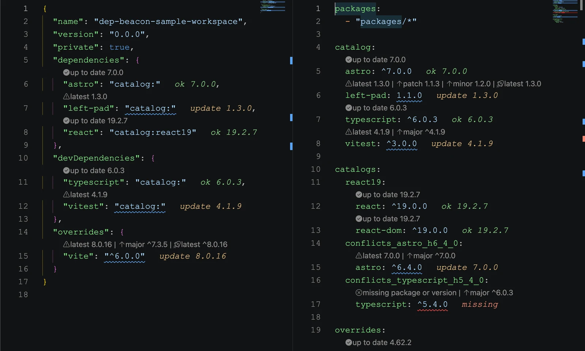

## Building dependency signals for VS Code

Dep Beacon is a VS Code extension and dependency intelligence engine for npm projects. It brings version status, safe update targets, pnpm workspace catalog awareness, and OSV vulnerability warnings directly into the manifests developers already edit.

The project includes a shared analysis core, the VS Code extension, and an Astro documentation site at [beacon.santi020k.com](https://beacon.santi020k.com/). The extension is available from the [Visual Studio Marketplace](https://marketplace.visualstudio.com/items?itemName=santi020k.vscode-dep-beacon) and [Open VSX](https://open-vsx.org/extension/santi020k/vscode-dep-beacon).

### Goals

- **Keep dependency decisions in context** by showing status beside the version ranges developers already review.
- **Make update targets practical** with patch, minor, major, and latest actions that preserve common range prefixes like `^` and `~`.
- **Respect workspace policy** by resolving default and named pnpm catalogs before reporting package status.
- **Surface security risk early** with OSV advisory checks that distinguish routine update work from vulnerable dependency ranges.

### What I built

- **A shared analysis core** (`@santi020k/dep-beacon-core`) that parses package manifests, npm registry metadata, semver ranges, pnpm catalogs, and OSV advisory responses.
- **A VS Code extension** (`vscode-dep-beacon`) with CodeLens update actions, inline status decorations, diagnostics, sorting, cache controls, prerelease toggles, and install commands.
- **Manifest support** for `package.json`, npm overrides, Yarn resolutions, pnpm overrides, `pnpm-workspace.yaml`, default catalogs, named catalogs, and package extensions.
- **A documentation site** built with Astro, including installation, configuration, VS Code usage, pnpm workspace behavior, and security-signal documentation.
- **Release tooling** for package validation, extension packaging, marketplace publishing, Open VSX publishing, and docs deployment.

### Technical highlights

- **Editor integration:** `VS Code Extension API`, CodeLens providers, diagnostics, command contributions, output channels, and document-aware activation.
- **Dependency intelligence:** npm-compatible registry lookups, semver target selection, package-range parsing, prerelease controls, and cache-aware analysis.
- **Workspace awareness:** pnpm catalog snapshots, overrides, package extensions, and manifest sections that centralize dependency policy.
- **Security checks:** OSV.dev vulnerability queries that map advisory severity to visible editor status.
- **Documentation:** an Astro docs app with generated preview assets, Open Graph images, and focused setup pages.

### Results

- **Dependency maintenance moved into the editor** instead of another dashboard or terminal-only workflow.
- **Safer update decisions** with clear choices for patch, minor, major, and latest targets.
- **Better monorepo support** for teams using pnpm catalogs to coordinate versions across packages.
- **A privacy-aware security path** where OSV checks can be disabled when a team does not want package/version data sent to an external advisory service.

### Why it matters

Dependency reviews are usually small, repetitive decisions until they are not. One range is stale. Another is catalog-managed. Another is vulnerable. Another is invalid or unpublished. Dep Beacon turns those scattered checks into visible editor signals so maintainers can decide faster without losing the nuance behind each manifest line.

That is the kind of developer tool I like building: small enough to stay close to the workflow, but opinionated enough to remove friction every time the file opens.
