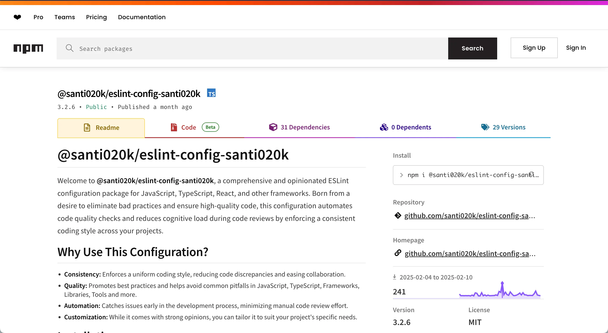

> **This library has been superseded.** `@santi020k/eslint-config-santi020k` has been replaced by [`@santi020k/eslint-config-basic`](/portfolio/eslint-config-basic/), which is more composable, better documented, and actively maintained. New projects should use that instead.

## Building my original ESLint toolkit

`@santi020k/eslint-config-santi020k` was my first published ESLint package, an opinionated set of rules for JavaScript and TypeScript projects designed to enforce consistency, catch common mistakes early, and reduce setup work across the kinds of apps I was building most often.

### 🎯 Goals

- **Standardize code quality** across my own projects and the teams I worked with.
- **Reduce setup friction** when spinning up React, Next.js, and TypeScript applications.
- **Make good defaults portable** so linting could be part of the workflow instead of an afterthought.

### 🛠️ What it included

- **Strict TypeScript and JavaScript defaults** aimed at preventing common errors and review churn.
- **Built-in support for React and Next.js** with optional presets for `Expo`, `Astro`, `TailwindCSS`, `Vitest`, and `i18next`.
- **Modular add-ons** so projects could opt into framework-specific needs without copying configuration by hand.
- **Automated publishing and examples** that made the package practical to maintain and easier to adopt.

### 🧠 Why it was replaced

As my projects grew and ESLint's flat config format became the standard, the original package architecture became harder to extend and maintain. Rather than continuing to patch it, I rebuilt the idea from scratch as [`@santi020k/eslint-config-basic`](/portfolio/eslint-config-basic/), a more composable toolkit with a wider framework footprint and better documentation.

### 🤝 Why it mattered

This project was the first time I turned internal engineering preferences into a reusable public tool. It helped clarify how I think about developer tooling in general: remove repetitive setup, codify what matters, and make quality easier to keep.

