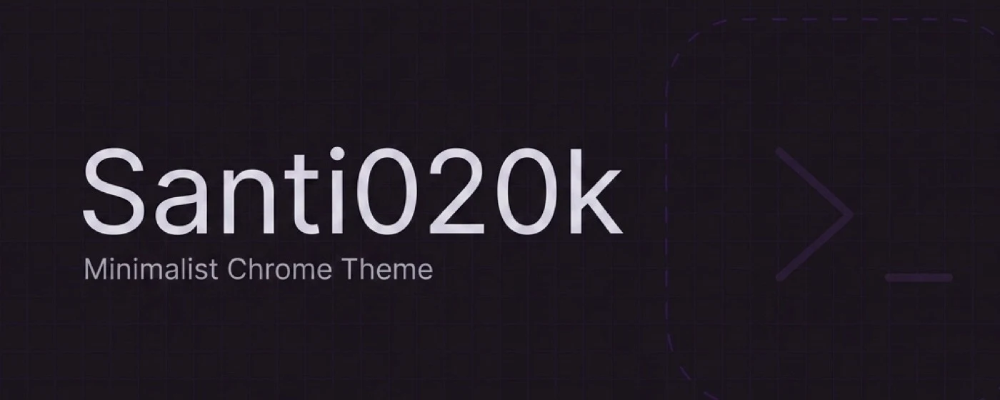
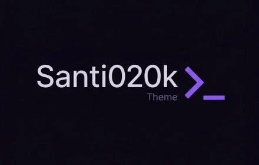
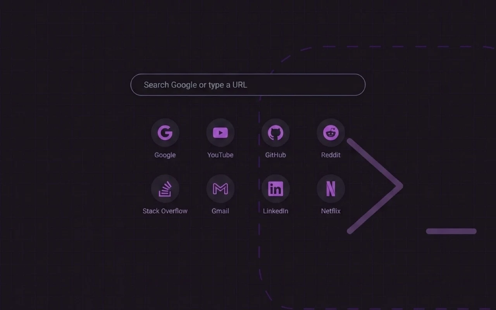

## Publishing my browser theme to the Chrome Web Store

Santi020k Chrome Theme is the browser companion to my [Santi020k VS Code Theme](/portfolio/santi020k-theme/). It brings the same deep violet surfaces, muted lavender text, and violet accents into Chrome, then packages that design as a real published theme on the [Chrome Web Store](https://chromewebstore.google.com/detail/santi020k-theme/cljcifjjgolaplmemjcnjhkjfoneadgj).

### Goals

- **Unified visual environment**: bring the same deep violet and muted lavender palette from the editor into the browser.
- **Token-level precision**: each Chrome surface traces back to a specific VS Code token, ensuring colors update in lockstep across both extensions.
- **Chrome Web Store readiness**: ship complete listing copy, screenshots, privacy policy, packaging scripts, and a repeatable validation path.
- **Zero attack surface**: themes ship as declarative JSON with no permissions and no remote code.

### What I built

- **A Chrome Manifest V3 theme** covering the frame, toolbar, tab strip, active/inactive tabs, New Tab page, omnibox, and incognito variant.
- **Color sync scripts** that pull token values directly from the VS Code theme source, keeping both extensions consistent across releases.
- **Validation tooling** that checks manifest structure, color contrast, and packaging readiness before every release.
- **A packaging pipeline** that produces a Chrome Web Store-ready zip from a single command.
- **Store listing assets** including screenshots, promo tiles, privacy documentation, and English listing copy.

### Results

- **Published Chrome Web Store theme** under the Santi020k Theme listing, with a public install path for Chrome users.
- **Auditable and privacy-respecting** — no permissions requested, no data collected, fully open source.
- **Repeatable release workflow** backed by validation scripts, automated packaging, and Changesets versioning.

### Why it matters

A theme that only covers the editor still leaves the browser feeling unrelated to the rest of the workspace. This project treats Chrome as a first-class surface in the same design system: same tokens, same release discipline, same calm palette.

