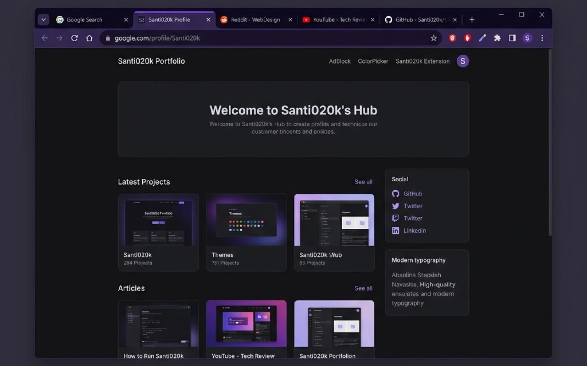
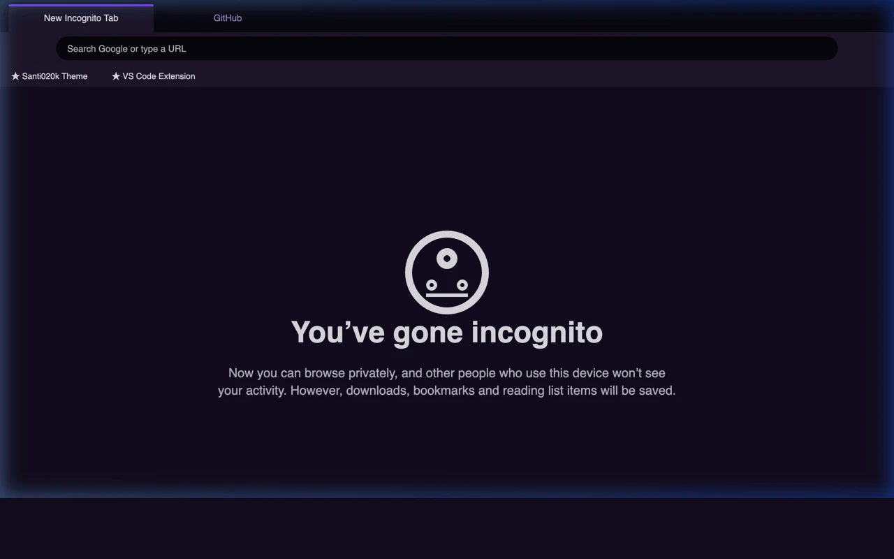
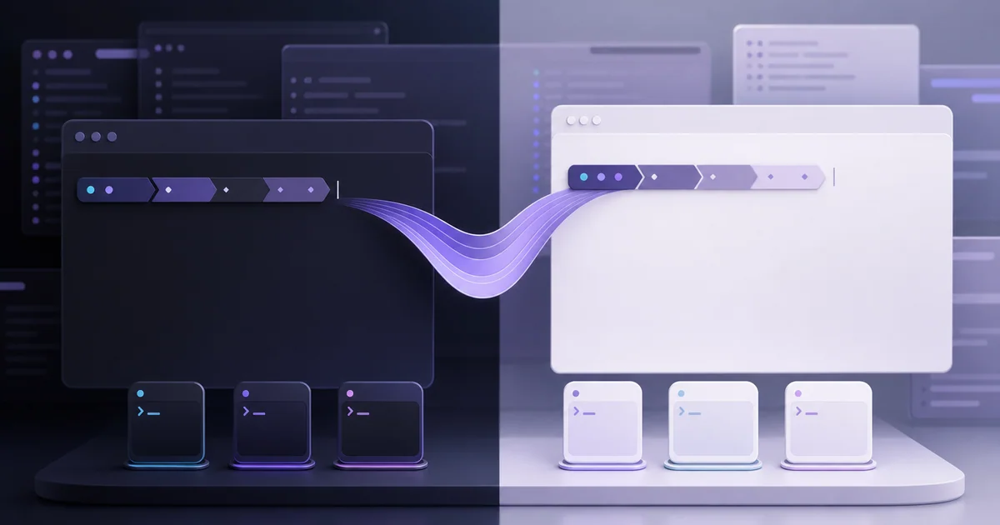

## Building one theme family across the developer workspace

I started Santi020k Theme as a focused pair of editor themes for the tools I use every day. It has grown into nine theme products: VS Code, Zed, Codex, Chrome, terminals, Raycast, Slack, JetBrains IDEs, and Xcode. Shared packages also support Shiki syntax highlighting, websites, prompts, and shells. The monorepo brings these products together with installation guides and previews on [theme.santi020k.com](https://theme.santi020k.com/).

The family shares one calm violet color language while respecting the capabilities of each surface. VS Code and compatible editors receive semantic highlighting and high-contrast variants. Chrome receives declarative, permission-free dark and light mappings. Shiki consumers receive importable syntax themes. Terminals receive generated palette formats and prompts that can follow the system appearance.

### Goals

- **Create a calm workspace** with coordinated dark, light, and high-contrast profiles for long technical sessions.
- **Keep every surface token-driven** so editors, browser chrome, code previews, terminals, prompts, and websites evolve from the same source.
- **Support typography preferences** through base, bold, and italic VS Code variants instead of one fixed syntax treatment.
- **Ship each surface like a product** with focused documentation, previews, validation, packaging, and release automation.

### What I built

- **Twelve VS Code variants** across dark, light, high-contrast dark, and high-contrast light profiles, each with base, bold, and italic syntax options.
- **A published Zed theme extension** with dark and light variants generated from the shared palette, available in the [Zed extension registry](https://zed.dev/extensions/santi020k-theme).
- **Codex custom theme presets** available through the [Codex theme page](https://theme.santi020k.com/codex/), with copy-ready appearance settings.
- **Raycast Pro and Slack themes** with Raycast import URLs and Slack custom color strings and semantic maps.
- **JetBrains and Android Studio support** through an installable dark/light plugin covering both the IDE interface and editor syntax.
- **Native Xcode themes** for editor syntax and debug-console colors in dark and light modes.
- **Dark and light Chrome themes** that map browser surfaces back to named editor tokens and ship without permissions, collected data, or remote code.
- **A terminal product** with dark and light palettes for iTerm2, Ghostty, Kitty, WezTerm, Windows Terminal, and Alacritty.
- **Rich, portable, and minimal Starship presets** plus managed Zsh, Bash, and Fish integration with automatic appearance selection.
- **Shared `@santi020k/theme` and `@santi020k/theme-core` packages** for tokens, assets, metadata, Chrome mappings, Tailwind values, product-site behavior, and importable Shiki themes.
- **One consolidated Astro website** for all nine products, with shared navigation, previews, installation guidance, and terminal documentation.
- **Validation and release pipelines** for marketplace metadata, contrast, generated theme files, terminal presets, packaging, and registry publishing.

The Chrome work originally lived as its own repository and portfolio project. Moving it beside the editor themes made palette synchronization enforceable: generation reads the editor source, maps each browser role through the shared package, and fails validation when a manifest drifts. Chrome remains independently packaged and published, but it is maintained as one surface of the same system.

The terminal edition applies the same system to a surface with different constraints. Its generated dark and light palettes target iTerm2, Ghostty, Kitty, WezTerm, Windows Terminal, and Alacritty, while rich, portable, and minimal Starship presets adapt to different fonts, machines, and information densities.

The `santi020k-terminal` CLI keeps installation and shell changes reviewable. It manages Zsh, Bash, and Fish integration, follows the macOS appearance when requested, preserves explicit overrides, installs terminal colors, backs up changed files, and provides status, repair, migration, import, export, preview, and custom prompt commands. Versioned archives and Homebrew distribution keep the product installable without separating its source of truth from the theme family.

### Results

- **One recognizable workspace language** across editors, AI coding tools, browsers, terminals, launchers, collaboration tools, and documentation.
- **Public distribution** through the Visual Studio Marketplace, Open VSX, Zed extension registry, Chrome Web Store, npm, GitHub releases, and Homebrew, alongside app-specific presets and installable packages.
- **Repeatable releases** backed by Changesets, generated artifacts, contrast checks, tests, linting, and package validation.
- **Portable theme infrastructure** that can support new tools without copying colors or brand assets by hand.

The editor variants work in VS Code, Cursor, Windsurf, VSCodium, GitHub Codespaces, and other compatible extension hosts. The shared package also exposes dark, light, and high-contrast themes for Shiki, Astro code blocks, and other consumers of VS Code theme JSON.

### Why it matters

Themes look simple from the outside, but a coherent workspace touches hierarchy, contrast, affordance, syntax, prompt density, operating-system appearance, packaging, and long-session comfort. Santi020k Theme treats those decisions as a design system instead of a collection of unrelated color files.

Explore the [theme family](https://theme.santi020k.com/) or go directly to the setup for your tools:

- [VS Code](https://theme.santi020k.com/vscode/), [Zed](https://theme.santi020k.com/zed/), and [Codex](https://theme.santi020k.com/codex/).
- [Chrome](https://theme.santi020k.com/chrome/) and [terminals](https://theme.santi020k.com/terminal/).
- [Raycast](https://theme.santi020k.com/raycast/) and [Slack](https://theme.santi020k.com/slack/).
- [JetBrains and Android Studio](https://theme.santi020k.com/jetbrains/) and [Xcode](https://theme.santi020k.com/xcode/).

For the implementation story, read how I [expanded the theme from editors to terminals](/blog/expanding-santi020k-theme-to-the-terminal/) and [shipped the macOS tooling through Homebrew](/blog/shipping-macos-tools-with-a-homebrew-tap/).
