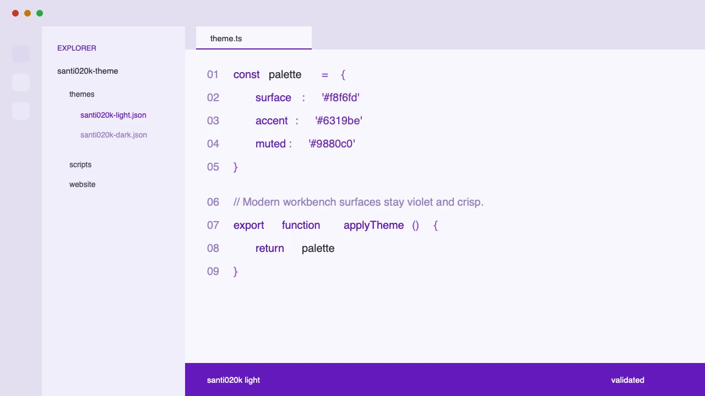

## Building a personal VS Code theme

I built Santi020k Theme as a focused pair of editor themes for the tools I use every day. The goal was not only to make VS Code feel more personal, but to turn that design work into a real extension with validation, documentation, release automation, and distribution through the registries developers actually use.

### Goals

- **Create a calm coding surface** with dark and light variants that share the same visual language.
- **Keep the theme practical** across editor chrome, terminals, panels, syntax scopes, settings, notifications, and Git states.
- **Ship it like a product** with marketplace metadata, preview assets, validation scripts, tests, and automated publishing.

### What I built

- **Two coordinated VS Code color themes**: `santi020k dark` and `santi020k light`, tuned around deep indigo surfaces and muted violet accents.
- **Theme validation scripts** that check package readiness, theme structure, registry assets, and contrast-sensitive color pairings.
- **A release pipeline** for publishing to the Visual Studio Marketplace and Open VSX from versioned releases.
- **A small documentation site** at [theme.santi020k.com](https://theme.santi020k.com/) with previews, install paths, and development notes.

### Results

- **Public extension distribution** through the VS Code Marketplace and Open VSX.
- **Repeatable releases** backed by Changesets, package validation, tests, linting, and build checks.
- **A stronger personal tooling system** where the visual layer, docs, and publishing workflow all live together.

### Why it matters

Editor themes look simple from the outside, but good ones touch a surprising amount of product design: hierarchy, contrast, affordance, state, and long-session comfort. This project gave me a compact way to practice those decisions while keeping the same engineering standards I use for larger tools.

