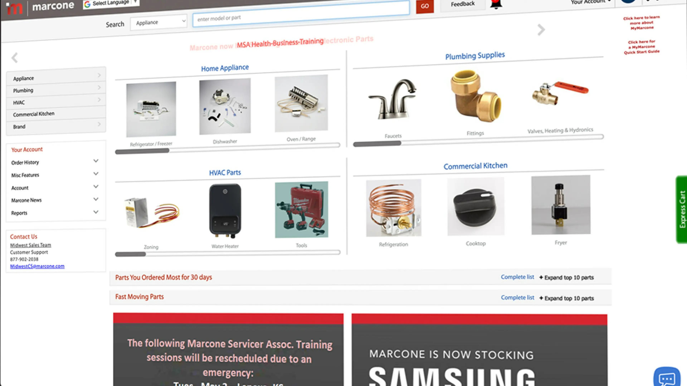
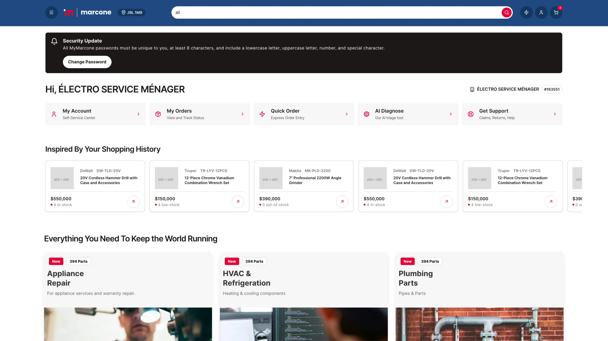

## Rebuilding Marcone for a headless future

At [Smith Commerce](https://smithcommerce.com), I worked on the frontend rebuild of [Marcone](https://www.marcone.com/), a large commerce experience being moved away from a legacy monolith. The old storefront was slow, inaccessible, and hard to evolve. The goal was to replace it with a modern headless frontend that could move faster without waiting on backend readiness.

### ⚠️ Core challenge

This was not a greenfield marketing site. It was a storefront migration with real performance debt, accessibility issues, and delivery pressure on both the frontend and backend sides. The work only mattered if the team could improve user experience immediately while still creating space for parallel delivery and longer-term maintainability.

### 🎯 What I owned

- **Front-end architecture from monorepo setup through launch,** helping shape the headless storefront foundations as the project moved into production.
- **Parallel delivery against mocked OpenAPI contracts,** so front-end and backend work could move independently without blocking each other.
- **UI systems, forms, and state patterns** using `Next.js 15`, `React 19`, `TypeScript`, `Radix UI`, `TanStack Query`, and `Zod`.
- **Developer experience improvements** through stronger linting, automation, and team standards that made delivery faster and less noisy.

### 📈 Key outcomes

- **Lighthouse score improved from 35 to 98.**
- **Time to Interactive dropped by 75%** and **First Contentful Paint improved by 60%**.
- **A 100% accessibility score** on the rebuilt storefront.

### 🛠️ Technical highlights

- **Frontend:** `Next.js`, `React`, `TypeScript`, `Tailwind CSS`, `Radix UI`, `Lucide React`
- **State and data:** `TanStack Query`, `Zustand`, `Apollo Client`, `OpenAPI`, `React Hook Form`, `Zod`
- **Delivery and quality:** `Turborepo`, `Storybook`, `ESLint`, `Prettier`, `Husky`, `Jest`, `Playwright`, `CI/CD`

### 🔍 Before and after

The difference was visible in both performance and experience:

  Before — Legacy Monolith

  After — Headless Storefront

## Why it mattered

This project brought together the parts of frontend work I enjoy most: architecture, performance, accessibility, and the delivery practices that help a team ship under pressure. It is also a good example of how much leverage comes from treating DX as part of product work, not as a side concern.
