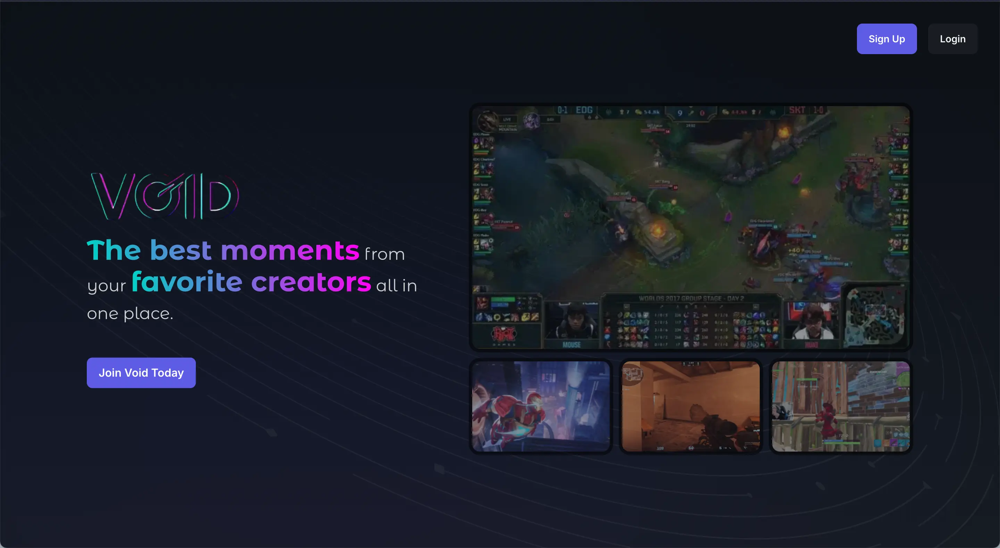
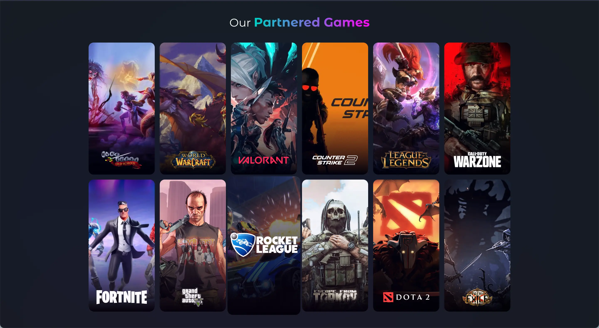

## Leading innovation in gaming and esports with Void

At [Void](https://www.void.gg/), I led technical work across a fast-moving gaming and esports platform with web, mobile, backend, and real-time requirements. The job was not only to make the product work. It was to help the team move faster without letting the architecture collapse under that speed.

### 🎯 What I led

- **Architecture direction** across microservices, microfrontends, mobile apps, and real-time features, defining the boundaries that kept the platform coherent as it grew.
- **Cross-functional delivery** for a 14+ person team spanning engineering, design, and product work across multiple tracks at once.
- **Release systems and engineering standards,** including CI/CD, documentation, code quality, and the operational guardrails that made shipping more predictable.
- **Performance ownership** across API behavior, caching strategy, front-end rendering, and live product surfaces powered by `Socket.io`.

### 📈 Key outcomes

- **35% better system performance** after improving APIs, caching, and real-time services under high-concurrency conditions.
- **95%+ sprint velocity** while helping a 14-person team keep shipping at pace under a demanding roadmap.
- **Around 60% faster deployments** after improving CI/CD and the systems behind release work.
- **40% less tech debt** by tightening standards, modular boundaries, and architectural expectations.

### 🛠️ Technical highlights

- **Frontend and mobile:** `React.js`, `Next.js`, `TypeScript`, `React Native`, `Redux Toolkit`, `Mantine UI`, `CSS Modules`
- **Platform and backend:** `Node`, `Nest.js`, `Express.js`, `Socket.io`, `MongoDB`, `PostgreSQL`, `AWS`, `Docker`
- **Quality and DX:** `GitHub Actions`, `Jest`, `Cypress`, `Storybook`, `Sentry`, `ESLint`, `NX`, `Developer Documentation`

### 🎮 Real-world impact

Void had to support live tournaments, community features, and fast product iteration without service degradation. The architecture decisions mattered because they affected real user engagement, real release cadence, and the team's ability to respond quickly to new opportunities in the platform.

### Why it mattered

Void brought together a lot of what I care about: product pace, team leadership, real-time systems, and architecture that has to survive growth. It is one of the clearest examples of how I like to lead: close to the code, focused on outcomes, and serious about removing friction for the team.
